# Báo cáo đồ án môn học
## 1. Môi trường thực hành
Cấu hình phần cứng: Laptop Dell Intel(R) Core i7-4510U 2.00GHz 8GB RAM
Card Wifi: TENDA-W311U+
Máy ảo: Kali Linux 2020
## 2. Sử dụng Aircrack-ng + Airodump-ng + Aireplay-ng để bẻ khóa các mật mã đơn giản
### Bước 1: Tìm đối tượng để thực hiện tấn công.
Sử dụng **airodump-ng** để tìm kiếm các wifi có mã hóa WEP
```sh 
 $ airodump-ng wlan0mon
```
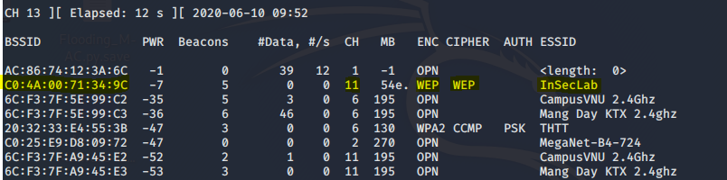

Các thông tin về wifi:
- BSSID: **C0:4A:00:71:34:9c** (là địa chỉ MAC của AP).
- Channel: **11** (kênh giao tiếp của AP).
- ESSID: **InSecLab** (tên của wifi).
- Wifi sử dụng mã hóa **WEP**.

Thực hiện chuyển channel của wlan0mon thành **11** (giống với channel của AP)
```sh
 $ iwconfig wlan0mon channel 11
```

### Bước 2: Kiểm tra Packet Injection
```sh
 $ aireplay-ng -9 -e InSecLab -a C0:4A:00:71:34:9C wlan0mon
```
- -9 là lựa chọn Injection test.
- -e là tên của wifi.
- -a là địa chỉ MAC của AP.
- wlan0mon là wireless interface.

Kết quả nhận được khi thực hiện lệnh trên
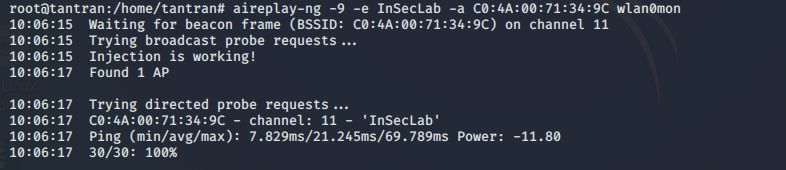

=> Kết quả trả về thành công (**30/30: 100%**)

### Bước 3: Sử dụng airodump-ng để bắt các IV (Initial Vector)
Ở bước này chúng ta sẽ sử dụng ***airodump-ng*** để bắt các **IV** được tạo ra bởi AP.
```sh
 $ airodump-ng -c 11 --bssid C0:4A:00:71:34:9C -w CaptureIV wlan0mon
```
- -c 11 là channel của mạng wifi.
- --bssid **C0:4A:00:71:34:9C** là địa chỉ MAC của AP.
- -w CaptureIV là file chứa những IV bắt được.
- wlan0mon là wireless interface.

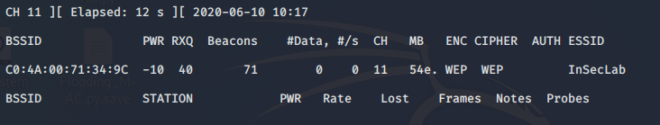

### Bước 4: Sử dụng aireplay-ng để tạo xác thực giả với AP
Nếu không có các kết nối nào khác vào AP thì sẽ không tạo mới các IV. Nên ta sẽ tạo ra các xác thực giả đến AP nhằm tạo ra các IV và bắt nó.
```sh
 $ aireplay-ng -1 0 -e InSecLab -a C0:4A:00:71:34:9C -h 00:0c:29:b8:bf:f1 wlan0mon
```
- -1 nghĩa là xác thực giả.
- 0 là thời gian để gửi lại gói tin.
- -e **InSecLab** là tên của wifi.
- -a **C0:4A:00:71:34:9C** là địa chỉ MAC của AP.
- -h **00:0c:29:b8:bf:f1** là địa chỉ MAC của máy chúng ta.
- **wlan0mon** là wireless interface.

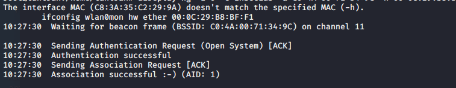

=> Gửi xác thực giả thành công.

### Bước 5: Sử dụng aireplay-ng tăng tín hiệu ARP để tạo ra nhiều IV
```sh
 $ aireplay-ng -3 -b C0:4A:00:71:34:9C -h 00:0c:29:b8:bf:f1 wlan0mon
```
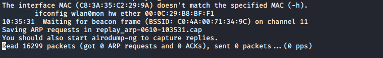

### Bước 6: Chờ để thu thập đủ IV cho việc crack
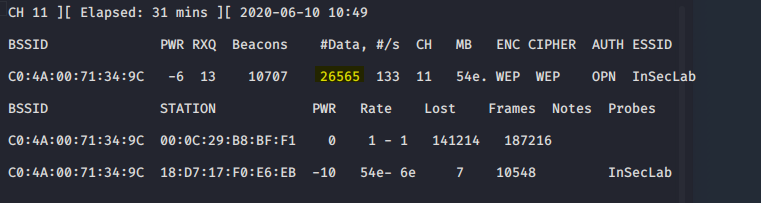

### Bước 7: Sử dụng aircrack-ng để tìm password của AP
```sh
 $ aircrack-ng -b C0:4A:00:71:34:9C CaptureIV-01.cap
```
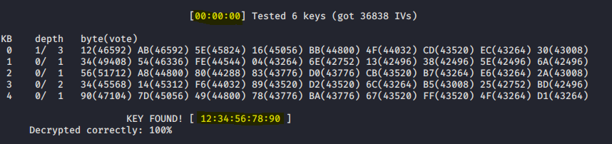

- Thời gian để tìm ra password là **0s**
- Password: **1234567890**

## 3. Sử dụng Kismet để Crack WEP

Sử dụng Kismet để kiểm tra các Wifi xung quanh
```sh
 $ kismet -c wlan0mon
```
Sử dụng giao diện người dùng của Kismet
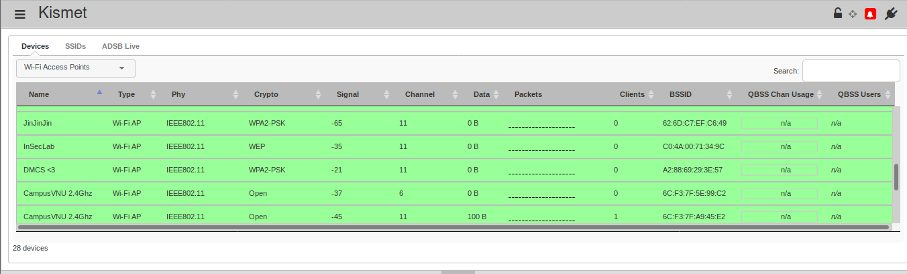

Nhấp vào tên wifi để xem thông tin của wifi đó (trong bài thực hành này là InSecLab)
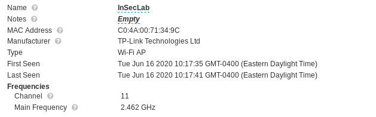
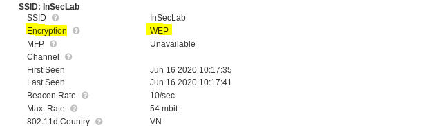

- Thông tin bao gồm tên Wifi
- Địa chỉ MAC của AP
- Channel của AP
- Mã hóa WEP

Sau khi thu thập được địa chỉ **MAC**, **ESSID**, **CHANNEL** của AP ta sẽ tiến hành crack nó theo các bước đã trình bày ở trên.

Tiến hành thu thập **IVs**
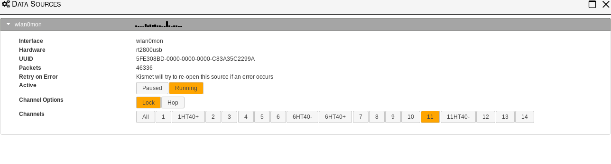

Tiến hành crack Wifi
```sh
 $ aircrack-ng -b C0:4A:00:71:34:9C CaptureIV.pcap
```

Kết quả
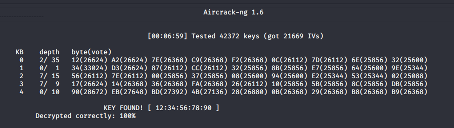

=> Pass wifi: ***1234567890***

## 4. Sử dụng CommView để Crack WEP
Sử dụng CommView để kiểm tra các mạng wifi xung quanh
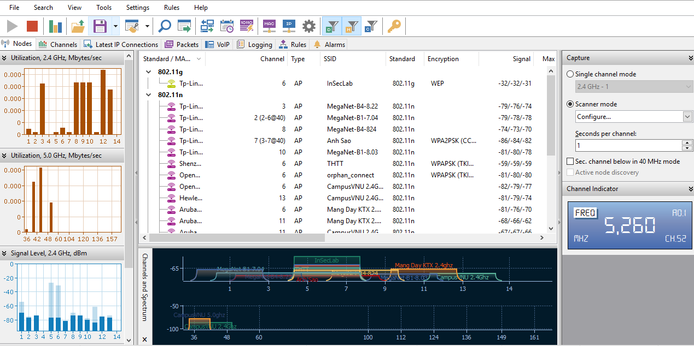

Xem thông tin của mạng wifi InSecLab
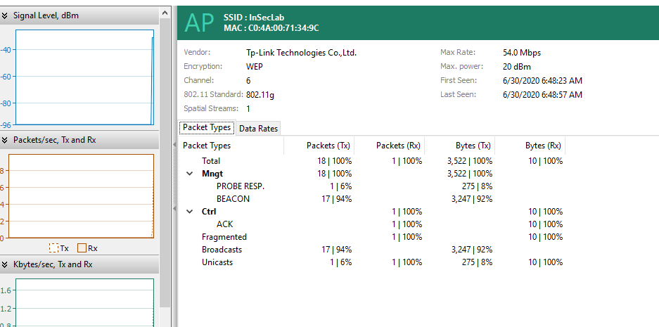

Cấu hình để CommView bắt các gói tin của AP InSecLab và lưu vào file log

Cấu hình Channel để CommView bắt gói tin
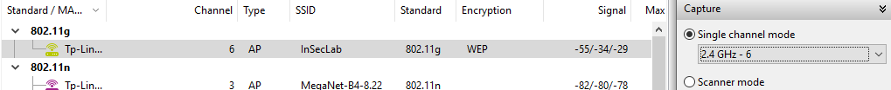

Cấu hình nơi lưu trữ file log
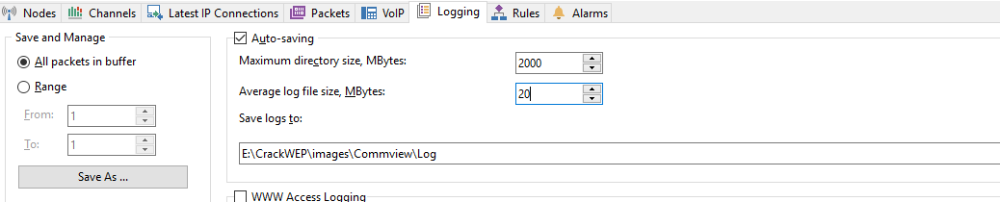

Tiến hành bắt gói tin
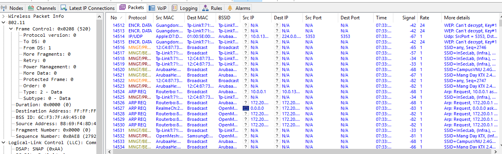

Chúng ta sẽ bắt đủ gói tin để thu thập đủ số IV cần thiết để crack WEP. Trong CommView, sau khi thu thập đủ số gói tin ta sẽ xem nó dưới dạng log
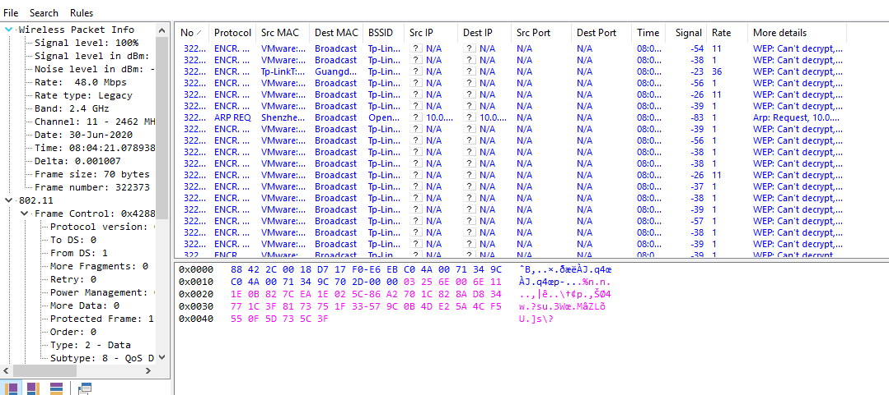

- Tiến hành Export file log thành file pcapng

Sau đó chúng ta sẽ sử dụng lệnh sau để chuyển đổi file **pcapng** thành file **pcap**
```sh
 $ tshark -F pcap -r raw.pcapng -w CaptureIV.pcap
```
Thực hiện crack sử dụng **aircrack-ng**
```sh
 $ aircrack-ng CaptureIV.pcap
```
Vì CommView bắt các gói tin dựa trên 1 channel cụ thể (do mình chỉ định hoặc có thể bắt các gói tin trên mọi channel) nên trong gói tin **pcap** không chỉ hiển thị AP mà ta muốn Crack mà còn rất nhiều AP khác chạy cùng channel với channel của AP muốn Crack. Nên chúng ta phải chọn tên của AP muốn Crack để **aircrack-ng** thực hiện nhiệm vụ.

Kết quả sau khi chạy lệnh trên
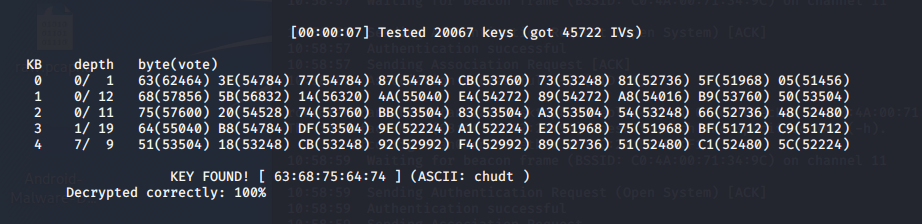

=> Mật khẩu: ***chudt***
